# AVR128DA48 Curiosity Nano Data Logger
## Repository Overview
This repository contains firmware for streaming up to 6-axes IMU data over UART from the AVR128DA48 Curiosity Nano board with Base board and Mikroe IMU2 or IMU14 Click boards, streaming using one of several formats as described in the sections below.

## Hardware Used
* AVR128DA48 Curiosity Nano Evaluation Kit [(DM164151)](https://www.microchip.com/Developmenttools/ProductDetails/DM164151)
* Curiosity Nano Base for Click boards™ [(AC164162)](https://www.microchip.com/developmenttools/ProductDetails/AC164162)
* IMU 2 click board (https://www.mikroe.com/6dof-imu-2-click)
* IMU 14 click board (https://www.mikroe.com/6dof-imu-14-click)

## Software Used
* MPLAB® X IDE (https://microchip.com/mplab/mplab-x-ide)
* MPLAB® XC8 compiler (https://microchip.com/mplab/compilers)
* MPLAB® Code Configurator (https://www.microchip.com/mcc)

## Related Documentation
* AVR128DA48 [Product Family Page](https://www.microchip.com/wwwproducts/en/AVR128DA48)

# How to Configure, Compile, and Flash
The steps below explain the process of configuring the the data logger firmware build, compiling it, and flashing it to the AVRDA device.

1. Plug the Curiosity Nano into your PC via USB.
2. Install the MPLAB X IDE and XC32 compiler. These are required to load the data logger project and to program the AVRDA board.
3. Open the `firmware/avr128da48_cnano_imu.X` project folder in MPLAB X.
4. Select the appropriate MPLAB X Project Configuration for your sensor according to the table below.
   | Sensor Type | MPLAB X Project Configuration Selection |
   | --- | --- |
   | Bosch BMI160 IMU | `AVR128DA48_CNANO_BMI160` |
   | TDK ICM42688 IMU | `AVR128DA48_CNANO_ICM42688` |

   Project configuration can be set in the MPLAB X toolbar drop down menu as shown in the image below

   | 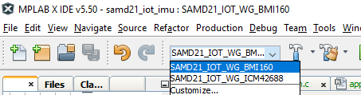 |
   | :--: |
   | *MPLAB X Project Configuration Selection* |
5. Select the data streaming format you want by setting the `DATA_STREAMER_FORMAT` macro in `firmware/src/app_config.h` to the appropriate value as summarized in the table below.
   | Streaming Format | app_config.h Configuration Value |
   | --- | --- |
   | ASCII text | `#define DATA_STREAMER_FORMAT DATA_STREAMER_FORMAT_ASCII` |
   | [MPLAB Data Visualizer](https://www.microchip.com/en-us/development-tools-tools-and-software/embedded-software-center/mplab-data-visualizer) stream | `#define DATA_STREAMER_FORMAT DATA_STREAMER_FORMAT_MDV` |
   | [SensiML Simple Stream](https://sensiml.com/documentation/simple-streaming-specification/introduction.html) | `#define DATA_STREAMER_FORMAT DATA_STREAMER_FORMAT_SMLSS` |
6. Modify high level sensor parameters like sample rate (`SNSR_SAMPLE_RATE`), accelerometer range (`SNSR_ACCEL_RANGE`), and others by changing the macro values defined in `firmware/src/app_config.h`. See the inline comments for further description.
7. Once you're satistfied with your configuration, click the *Make and Program Device* button in the toolbar (see image below for reference).
   | 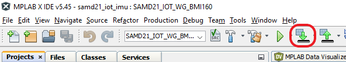 |
   | :--: |
   | *Make and Program Device* |

# Firmware Operation
The data streamer firmware will output sensor data over the UART port with the following UART settings:

* Baudrate 115200
* Data bits 8
* Stop bits 1
* Parity None

In addition, the onboard LED0 will indicate firmware status as summarized in the table below:

| State |	LED Behavior |	Description |
| --- | --- | --- |
| Streaming |	LED0 slow blink |	Data is streaming. |
| Listening (SensiML only) |	LED0 on |	Waiting for connection request from SensiML DCL. |
| Error |	LED0 off |	Fatal error. (Do you have the correct sensor plugged in?). |
| Buffer Overflow |	LED0 on for 5 seconds	| Processing is not able to keep up with real-time; data buffer has been reset. |

# Usage with the MPLAB Data Visualizer and Machine Learning Plugins
This project can be used to generate firmware for streaming data to the [MPLAB Data Visualizer plugin](https://www.microchip.com/en-us/development-tools-tools-and-software/embedded-software-center/mplab-data-visualizer) by setting the `DATA_STREAMER_FORMAT` macro to `DATA_STREAMER_FORMAT_MDV` as described above. Once the firmware is flashed, follow the steps below to set up Data Visualizer.

1. Connect the Curiosity board to your computer, open up MPLAB X, and open the Data Visualizer plugin.
2. Click the *Load Workspace* button as highlighted in the image below. Select one of the workspace files included in this repository - located under the `mplab-dv-workspaces` folder - whose name most closely describes your sensor configuration; you can always modify the configuration once it is loaded if needed.

| 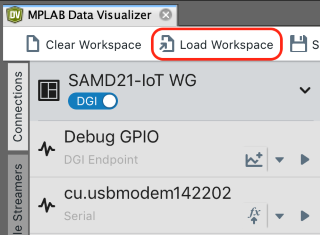 |
| :--: |
| *Loading the workspace file* |

3. Next, select the Serial/CDC Connection that corresponds to the Curiosity board, adjust the baud rate to 115200, and click *Apply*.

| 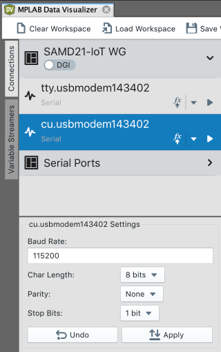 |
| :--: |
| *Configuring the AVRDA serial port* |

4. Use the play button on the Serial/CDC Connection to connect to the serial port. Once the connection is made, the AVRDA will be available for use with the variable streamer.

| 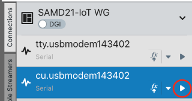 |
| :--: |
| *Start Streaming* |

5. Switch to the *Variable Streamers* tab and select the aforementioned Serial/CDC Connection from the drop down menu as the input data source for the IMU variable streamer (see image below for reference); this will enable parsing of the AVRDA data stream. You may delete or add variables here if your sensor configuration differs from the pre-loaded ones.

|  |
| :--: |
| *Variable streamer data source selection* |

The IMU data should now be available in the time plot. Double click anywhere within the time plot to start/stop scrolling of the time axis

| 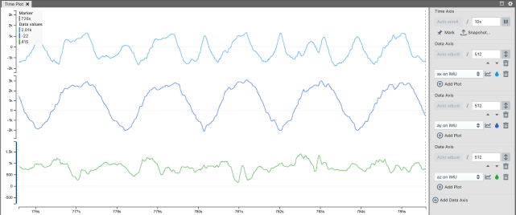 |
| :--: |
| *Data Visualizer Time Plot* |

Visit the [Machine Learning Plugin page](https://microchipdeveloper.com/machine-learning:ml-plugin) to learn more about using the Data Visualizer plugin to export your data for machine learning applications.

# Usage with the SensiML Data Capture Lab
This project can be used to generate firmware for streaming data to the [SensiML Data Capture Lab](https://sensiml.com/products/data-capture-lab/) (DCL) using the Simple Streaming Interface (SSI) format by setting the `DATA_STREAMER_FORMAT` macro to `DATA_STREAMER_FORMAT_SMLSS` as described above. Once the firmware is flashed, follow the steps below to set up direct streaming to DCL.

1. Open up DCL and open your existing project or create a new one.

2. Switch to *Capture* mode by clicking the *Switch Modes* button.

| 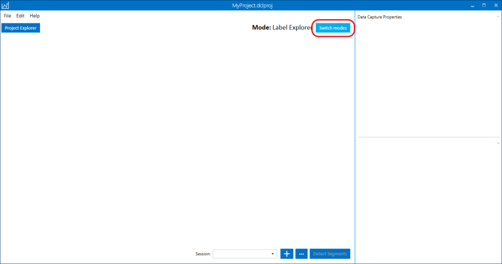 |
| :--: |
| *Switch to Capture Mode* |

3. In capture mode, click the *Setup Sensor Configuration* in the upper right quadrant of the DCL window.

| 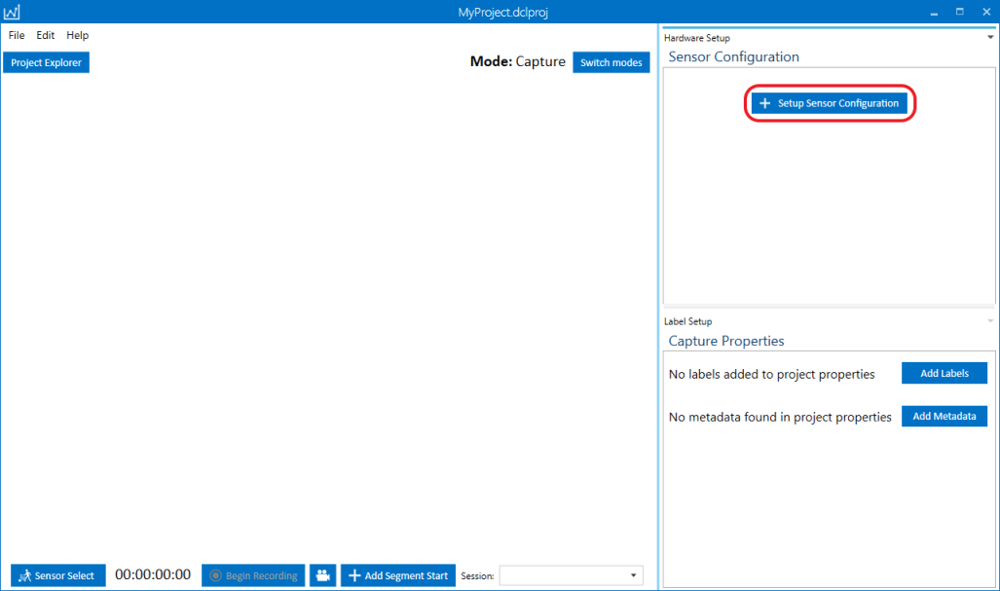 |
| :--: |
| *Setup a New Sensor* |

4. In the *Select a Device Plugin* window select the SAMD21 ML Eval Kit item and click Next. *Note: the Curiosity Nano is not an officially listed device, but works the same as the SAMD21*.

| 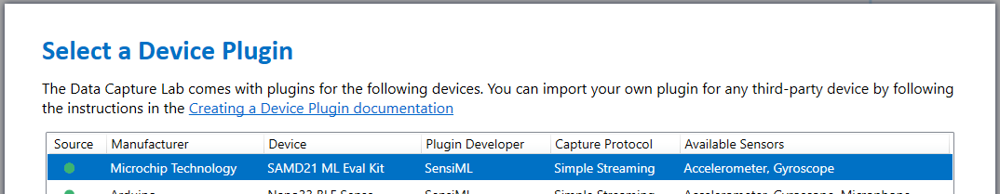 |
| :--: |
| *Select Device* |

5. After selecting the device plugin, the *Plugin Details* page will appear; skip this by clicking *Next* to move forward to the *Sensor Properties* page. On the properties page, fill out the fields according to how your device is configured in the `app_config.h` firmware configuration file, then click Next.

|  |
| :--: |
| *Sensor Configuration* |

6. Give a name to the sensor configuration in the *Save Sensor Configuration* window. If you plan on trying different configurations for your application, it's a good idea to include a summary of the sensor configuration in the name, for example, `bmi160-100hz-16g-2000dps`. Click *Save* to save the sensor configuration to your project.

| 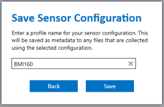 |
| :--: |
| *Save Sensor Configuration* |

7. Back in the main DCL window, select *Serial Port* from the *Connection Method* dropdown in the *Sensor Configuration* section of the window, then click the *Find Devices* button. 

| 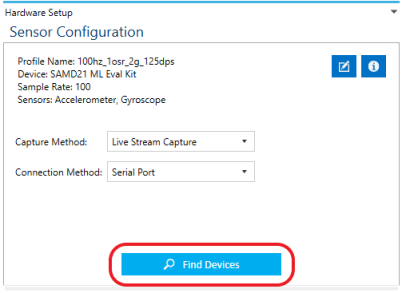 |
| :--: |
| *Find Devices* |

8. In the *Find a Device* window click the *Scan* button to list connected devices. Select the SAM ML Eval Kit and click *Connect*.

| 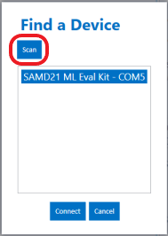 |
| :--: |
| *Scan Connected Devices* |

The Curiosity Nano should now be streaming to the DCL. Check out SensiML's [documentation](https://sensiml.com/documentation/) to learn more about how to use the DCL for capturing and annotating data.